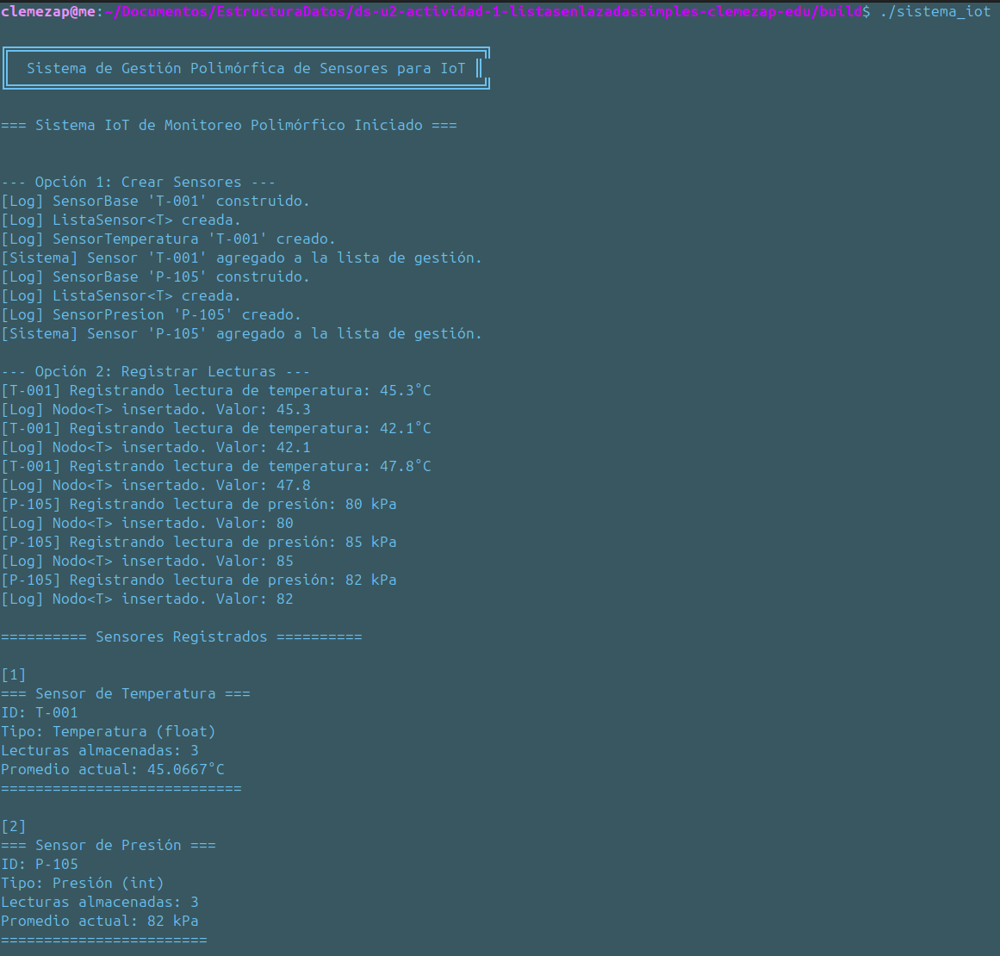
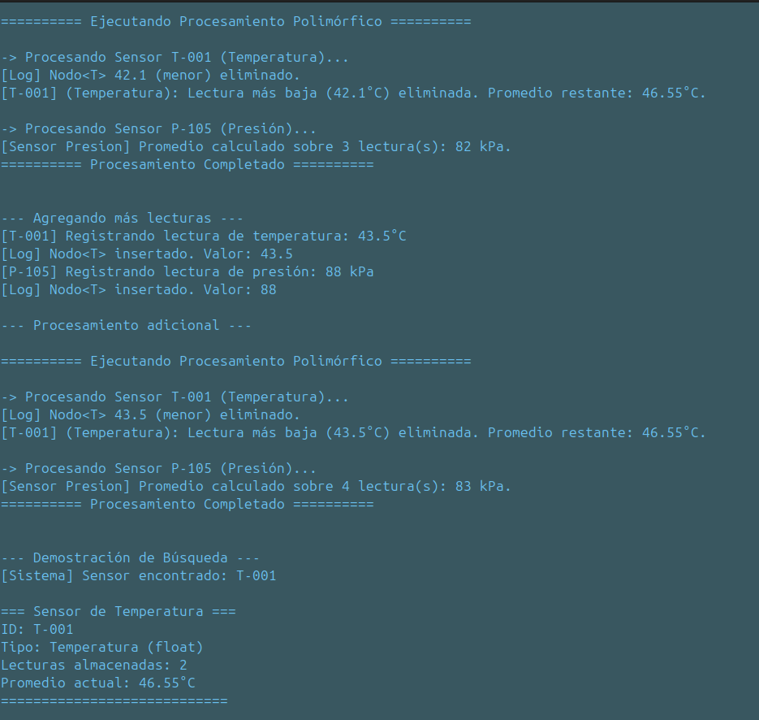
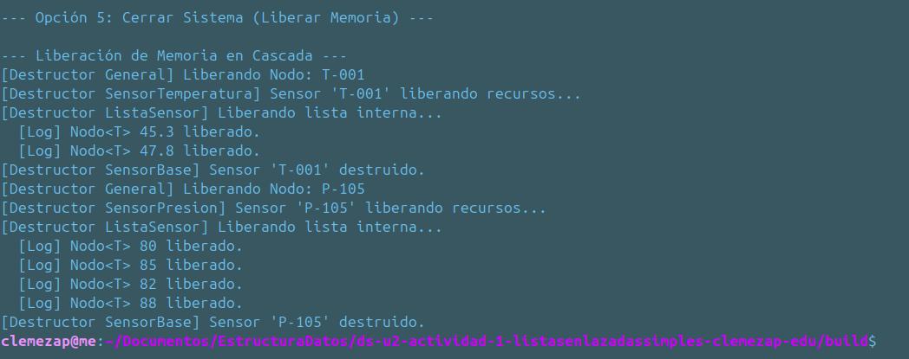
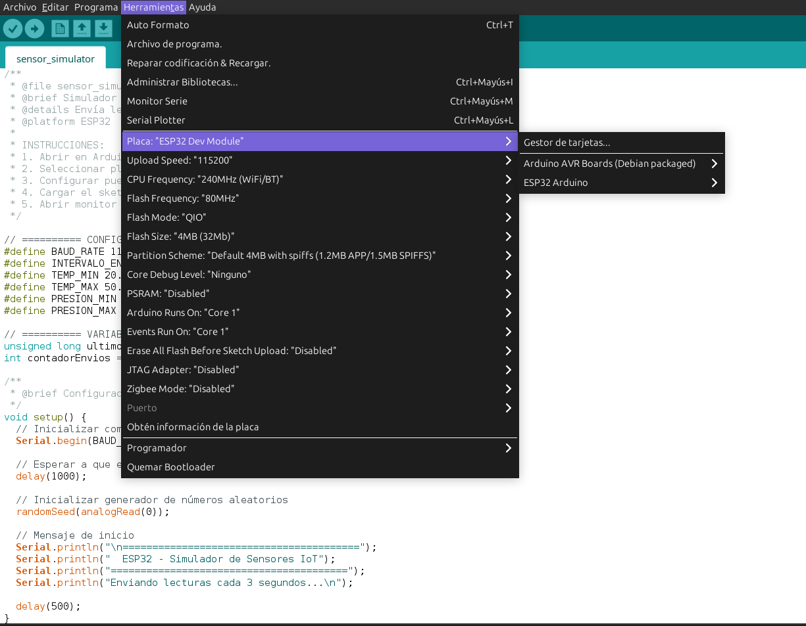

# Sistema de Gestión Polimórfica de Sensores para IoT.

## Introducción
El presente documento detalla la implementación de un Sistema de Gestión Polimórfica de Sensores para Infraestructura Crítica (IC). El objetivo principal es desarrollar una solución de software de bajo nivel que aborde las limitaciones de rigidez de tipo de dato y rigidez estructural en la monitorización heterogénea de sensores (ej. temperatura, presión).

La arquitectura del sistema capitaliza los paradigmas avanzados de la Programación Orientada a Objetos (POO) y la gestión manual de estructuras de datos en C++ para crear un contenedor unificado capaz de manejar distintos tipos de sensores y sus respectivas lecturas de forma dinámica y segura. Se hace uso intensivo de polimorfismo a través de herencia de clases abstractas y plantillas (templates) para la generalización del tipo de dato de las lecturas.

## Diseño

### Componentes Clave

|Componente| Funcionalidad|
|----------|--------------|
|```SensorBase```|Define la interfaz común (```procesarLectura()```, ```imprimirInfo()```) mediante métodos virtuales puros. Incluye un destructor virtual (```virtual ~SensorBase()```) esencial para la correcta liberación de memoria en cascada del polimorfismo.|
|```SensorTemperatura```|Contiene una instancia de ```ListaSensor<float> historial```;. Su método ```procesarLectura()``` implementa la lógica de negocio específica: eliminar el valor más bajo y calcular el promedio restante.|
|```SensorPresion```|Contiene una instancia de ```ListaSensor<int> historial;```. Su método ```procesarLectura()``` implementa la lógica específica: calcular el promedio de todas las lecturas.|
|```ListaSensor<T>```|Provee la funcionalidad dinámica de la estructura de datos. Implementa las operaciones básicas (inserción, búsqueda, promedio). Su diseño adhiere a la Regla de los Tres/Cinco para el manejo explícito de punteros (```Nodo<T>* cabeza```) y prevenir fugas de memoria.|
|```SistemaGestion```|Controla el flujo de la aplicación. Gestiona la lista polimórfica de punteros ```SensorBase*```. Su método ```procesarTodosSensores()``` es el punto de aplicación del polimorfismo, invocando ```procesarLectura()``` de forma unificada.|

### Desarrollo
Se implementa la interfaz común en la clase base abstracta, forzando a las clases concretas a definir sus operaciones específicas de procesamiento y presentación, lo que garantiza la uniformidad en la interacción del sistema central con sus componentes.

La liberación de recursos se maneja en cascada. El destructor de ```SistemaGestion``` recorre su listam elimina cada ```SensorBase*```. El destructor de cada subclase, a su vez, invoca la función de liberación de memoria de su lista genérica interna (```ListaSensor<T>::liberarNodos()```).

El proyecto está configurado para ser gestionado y distribuido mediante CMake, lo que facilita la compilación multiplataforma y la creación de un sistema redistribuible.

## Pantallasos de la Implementación Generada




